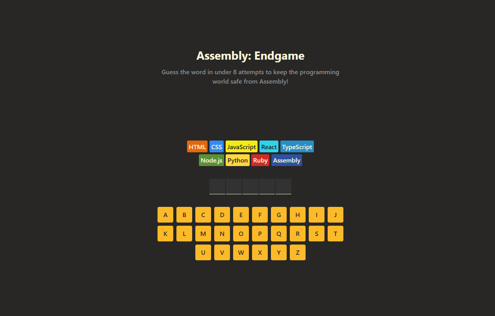

# 💀 Hangman: Programming Languages Edition 🕹️



A fun little word-guessing game — but with a twist:  
Every wrong guess **kills a programming language**!  
Can you save them all? Or will they all perish under your typos? 😅

---

## 🎮 How to Play

- You’re given a hidden word (represented by blanks `_ _ _ _`).
- Click or tap letters to guess them.
- If the letter is correct → it fills in the word ✅
- If it’s wrong → one programming language gets eliminated ❌ (RIP 😔)
- Win by guessing the full word before all languages are gone!

---

## 🛠️ Tech Stack

- **React** (built with functional components and hooks)
- **CSS** for styling
- No external libraries — pure and clean ⚡

---

## 🚀 Running Locally

1. **Clone this repo:**
   ```bash
   git clone https://github.com/YacoubDweik/guess-the-word-game.git
